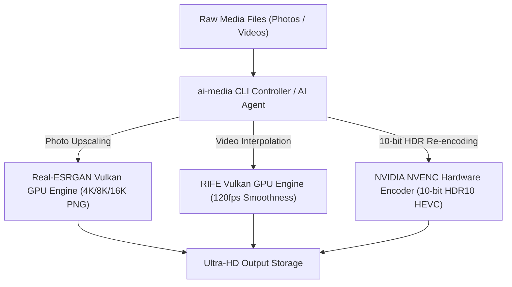

# ✨ AI Media Upscaler CLI

🌐 **[简体中文](README_ZH.md)** | **English**

[](https://www.python.org/downloads/)
[](LICENSE)
[](#)
[](skills/media-upscaler/SKILL.md)

> **GPU-Accelerated Photo 4K/8K AI Super-Resolution and Video 120fps HDR Interpolation CLI.**

`media-pipeline` (ai-media) is a high-performance, lightweight CLI tool for batch upgrading photos and videos using GPU hardware acceleration (Vulkan & TensorRT).

---

## 🤖 Zero-Manual-Clone 1-Sentence Prompt for AI Agents (OpenClaw / Claude / Cursor / AGY)

Users **do NOT need to manually clone** the repository. Give this 1-sentence prompt directly to any AI Agent, and it will fetch the raw skill spec, auto-install, and execute:

> 💬 *"Read https://raw.githubusercontent.com/Francis-Xavier-code/media-pipeline-cli/main/skills/media-upscaler/SKILL.md, auto-install it, and use GPU AI to batch upscale my photos and videos to 4K 120fps HDR."*

---

## ✨ Features

- **🖼️ Photo 4K/8K AI Super-Resolution**: Batch upscales images using Real-ESRGAN Vulkan models.
- **🎬 Video 120fps Frame Interpolation**: Interpolates 24fps/30fps videos up to 60fps/120fps using RIFE.
- **🌟 10-bit HDR10 Conversion**: Re-encodes videos to 10-bit HDR using hardware NVENC GPU encoders.
- **🔒 Tiling Protection**: Prevents VRAM Out-of-Memory crashes by processing frames in tile chunks.

---

## 🖼️ Before vs After Comparison


| 📷 Before (Low-res / SDR) | ✨ After (Real-ESRGAN AI 4K/8K Lossless Reconstruction) |
| :---: | :---: |
| Low pixel count, blurry textures | **Pixel-level detail rewrite, upgraded to 13K ultra-clear lossless PNG** |

---

## 🛠️ Prerequisites

| Requirement | Details |
|:---|:---|
| **Python** | 3.8 or higher |
| **GPU** | NVIDIA RTX series (Vulkan support required) |
| **Photo Engine** | [Real-ESRGAN ncnn Vulkan](https://github.com/xinntao/Real-ESRGAN/releases) binary |
| **Video Engine** | [RIFE ncnn Vulkan](https://github.com/nihui/rife-ncnn-vulkan/releases) binary |

---

## 🛠️ Installation

```bash
pip install git+https://github.com/Francis-Xavier-code/media-pipeline-cli.git
```

---

## 🚀 CLI Usage

### 1. Photo 4K/8K AI Upscaling
```bash
ai-media photo \
  --input "./input_photos" \
  --output "./output_4k_photos" \
  --exe "./bin/realesrgan-ncnn-vulkan.exe" \
  --gpu 0 \
  --scale 4
```

### 2. Video 120fps & 10-bit HDR Interpolation
```bash
ai-media video \
  --input "./input_video.mp4" \
  --output "./output_120fps_hdr" \
  --exe "./bin/rife-ncnn-vulkan.exe" \
  --gpu 0 \
  --fps 120 \
  --hdr
```

---

## 📋 CLI Argument Reference

### `ai-media photo`

| Argument | Short | Required | Default | Description |
|:---|:---:|:---:|:---:|:---|
| `--input` | `-i` | ✅ | — | Input photos directory |
| `--output` | `-o` | ✅ | — | Output 4K photos directory |
| `--exe` | — | ✅ | — | Path to `realesrgan-ncnn-vulkan.exe` |
| `--gpu` | — | — | `0` | GPU device ID |
| `--scale` | — | — | `4` | Upscale factor (`2`, `4`, `8`) |
| `--no-dedupe` | — | — | `false` | Disable MD5 content deduplication |

### `ai-media video`

| Argument | Short | Required | Default | Description |
|:---|:---:|:---:|:---:|:---|
| `--input` | `-i` | ✅ | — | Input video file or directory |
| `--output` | `-o` | ✅ | — | Output video directory |
| `--exe` | — | ✅ | — | Path to `rife-ncnn-vulkan.exe` |
| `--gpu` | — | — | `0` | GPU device ID |
| `--fps` | — | — | `120` | Target FPS (`60`, `120`) |
| `--hdr` | — | — | `false` | Enable 10-bit HDR10 color re-encoding |

---

## 📁 Project Structure

```
media-pipeline-cli/
├── ai_media_upscaler/          # Core Python package
│   ├── __init__.py
│   ├── cli.py                  # CLI entry point & argument parser
│   ├── photo_engine.py         # Real-ESRGAN Vulkan photo upscaling engine
│   └── video_engine.py         # RIFE Vulkan video interpolation engine
├── assets/                     # Comparison images for documentation
├── skills/                     # AI Agent skill specifications
│   └── media-upscaler/
│       └── SKILL.md
├── LICENSE                     # MIT License
├── pyproject.toml              # Python package configuration
├── setup.py                    # Legacy setup script
├── README.md                   # English documentation
└── README_ZH.md                # Chinese documentation
```

---

## 🤝 Contributing

Contributions are welcome! Please follow these steps:

1. Fork the repository
2. Create a feature branch (`git checkout -b feature/amazing-feature`)
3. Commit your changes (`git commit -m 'Add amazing feature'`)
4. Push to the branch (`git push origin feature/amazing-feature`)
5. Open a Pull Request

---

## 🏗️ Architecture



---

## 📄 License

Distributed under the MIT License. See [LICENSE](LICENSE) for details.
