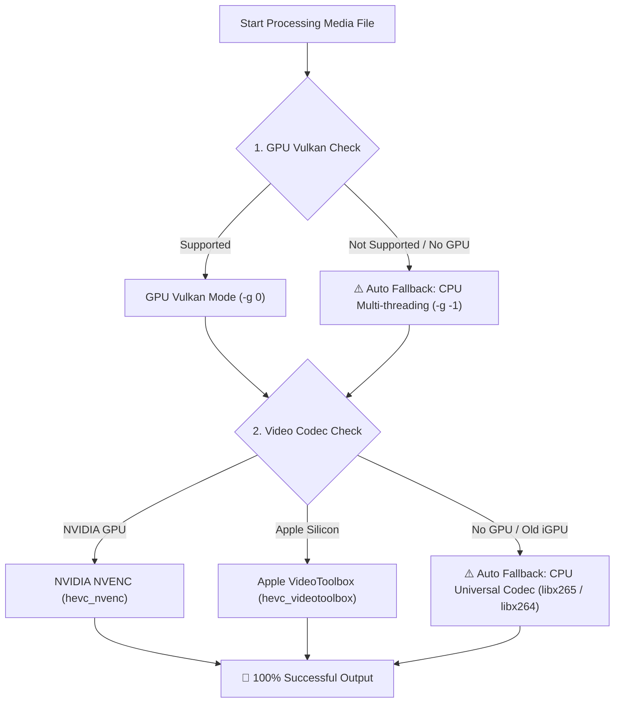

# ✨ AI Media Upscaler CLI

🌐 **[简体中文](README_ZH.md)** | **English** | **[📚 Documentation Directory (docs/)](docs/CLI_USAGE.md)** | **[🏗️ Architecture Spec](docs/ARCHITECTURE.md)** | **[📦 Releases](https://github.com/Francis-Xavier-code/media-pipeline-cli/releases)**

[](https://www.python.org/downloads/)
[](LICENSE)
[](#)
[](#)
[](#)
[](skills/media-upscaler/SKILL.md)

> **GPU-Accelerated & CPU-Fallback Cross-Platform (Windows, Linux, macOS) Photo 4K/8K AI Super-Resolution and Video 120fps HDR Interpolation CLI with Full Daemon Process Management.**

---

## ⚡ 1-Line Online Installer

Run directly in your terminal without manually cloning the repository:

### 🪟 Windows (PowerShell):
```powershell
irm https://raw.githubusercontent.com/Francis-Xavier-code/media-pipeline-cli/main/install.ps1 | iex
```

### 🐧 Linux & 🍎 macOS (Terminal / Bash):
```bash
curl -fsSL https://raw.githubusercontent.com/Francis-Xavier-code/media-pipeline-cli/main/install.sh | bash
```

---

## ⚙️ Daemon Process & Lifecycle Management Subcommands

```bash
# 1. 📊 Check live status (PID, active engine status, latest output log)
ai-media status

# 2. 🛑 Force stop all active background pipeline processes
ai-media stop

# 3. 🧹 Force stop processes and remove temporary cache folders
ai-media clean

# 4. 🚀 Resume/continue pipeline execution from breakpoint
ai-media continue

# 5. 🔄 Restart background pipeline process from breakpoint
ai-media restart

# 6. 📺 Watch live UTF-8 streaming processing log
ai-media log

# 7. 🗑️ Stop processes, clean caches, and cleanly uninstall ai-media package
ai-media uninstall
```

---

## 🤖 Zero-Manual-Clone 1-Sentence Prompt for AI Agents (OpenClaw / Claude / Cursor / AGY)

```bash
Read https://raw.githubusercontent.com/Francis-Xavier-code/media-pipeline-cli/main/skills/media-upscaler/SKILL.md, auto-install it, and use GPU/CPU fallback AI to batch upscale my photos and videos to 4K 120fps HDR.
```

---

## 🛡️ Zero-Crash Hardware Fallback Architecture



---

## 💻 Cross-Platform Compatibility Matrix

| OS Platform | Preferred GPU Acceleration | CPU Fallback Mode |
| :--- | :--- | :--- |
| **🪟 Windows** | Vulkan (NVIDIA / AMD / Intel) | CPU Multi-threading (`-g -1`) + `libx265` |
| **🐧 Linux** | Vulkan API | CPU Multi-threading (`-g -1`) + `libx265` |
| **🍎 macOS (Apple Silicon M1/M2/M3/M4 & Intel)** | Apple Metal / MoltenVK | CPU Multi-threading (`-g -1`) + `libx265` |

---

## 📄 License

Distributed under the MIT License. See [LICENSE](LICENSE) for details.
