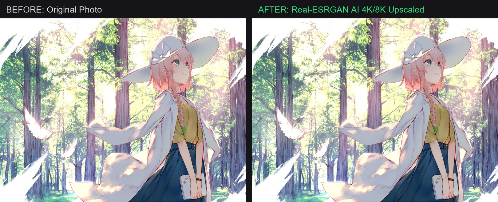

# ✨ AI Media Upscaler CLI

🌐 **[简体中文](README_ZH.md)** | **English**

[](https://www.python.org/downloads/)
[](LICENSE)
[](#)
[](skills/media-upscaler/SKILL.md)

> **GPU-Accelerated Photo 4K/8K AI Super-Resolution and Video 120fps HDR Interpolation CLI.**

`media-pipeline` (ai-media) is a high-performance, lightweight CLI tool for batch upgrading photos and videos using GPU hardware acceleration (Vulkan & TensorRT).

---

## 🖼️ Before vs After Preview



---

## ✨ Features

- **📺 Real-Time Streaming Logs (`ai-media log`)**: Dedicated CLI command to watch live UTF-8 streaming logs with zero garbled text.
- **⏩ Automatic Breakpoint Resume**: Interruptions, shutdowns, or re-runs instantly skip 100% completed files and resume right where it left off!
- **📐 Aspect-Ratio Safe Scaling**: Auto-detects portrait (vertical) vs landscape (horizontal) media, preventing squished or stretched distortion.
- **🖼️ Photo 4K/8K AI Super-Resolution**: Batch upscales images using Real-ESRGAN Vulkan models.
- **🎬 Video 120fps Frame Interpolation**: Interpolates 24fps/30fps videos up to 60fps/120fps using RIFE.
- **🌟 10-bit HDR10 Conversion**: Re-encodes videos to 10-bit HDR using hardware NVENC GPU encoders.
- **🔒 Tiling Protection**: Prevents VRAM Out-of-Memory crashes by processing frames in tile chunks.

---

## 🤖 Zero-Manual-Clone 1-Sentence Prompt for AI Agents (OpenClaw / Claude / Cursor / AGY)

Users **do NOT need to manually clone** the repository. Give this 1-sentence prompt directly to any AI Agent, and it will fetch the raw skill spec, auto-install, and execute:

> 💬 *"Read https://raw.githubusercontent.com/Francis-Xavier-code/media-pipeline-cli/main/skills/media-upscaler/SKILL.md, auto-install it, and use GPU AI to batch upscale my photos and videos to 4K 120fps HDR."*

---

## 🛠️ Installation (Optional)

```bash
pip install git+https://github.com/Francis-Xavier-code/media-pipeline-cli.git
```

---

## 🚀 CLI Usage

### 1. Watch Real-Time Logs
```bash
ai-media log
```

### 2. Photo 4K/8K AI Upscaling
```bash
ai-media photo \
  --input "./input_photos" \
  --output "./output_4k_photos" \
  --exe "./bin/realesrgan-ncnn-vulkan.exe" \
  --gpu 0 \
  --scale 4
```

### 3. Video 120fps & 10-bit HDR Interpolation
```bash
ai-media video \
  --input "./input_video.mp4" \
  --output "./output_120fps_hdr" \
  --exe "./bin/rife-ncnn-vulkan.exe" \
  --gpu 0 \
  --fps 120 \
  --hdr
```

---

## 📄 License

Distributed under the MIT License. See [LICENSE](LICENSE) for details.
