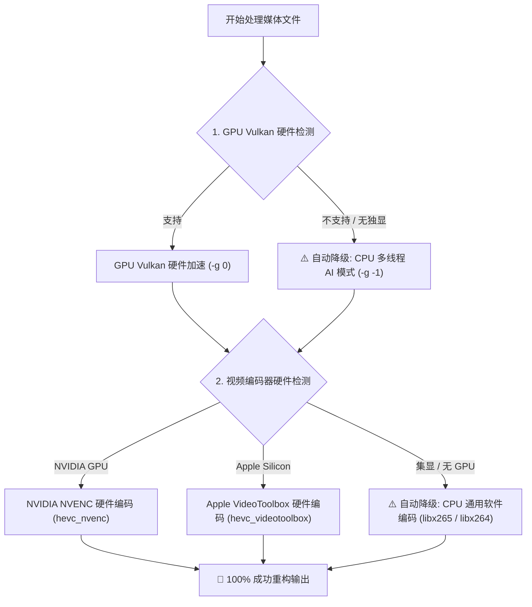

# ✨ AI Media Upscaler CLI (媒体 AI 画质重构工具)

🌐 **简体中文** | **[English](README.md)** | **[📚 完整文档目录 (docs/)](docs/CLI_USAGE_ZH.md)** | **[🏗️ 系统架构设计](docs/ARCHITECTURE_ZH.md)** | **[📦 Releases (发布包)](https://github.com/Francis-Xavier-code/media-pipeline-cli/releases)**

[](https://www.python.org/downloads/)
[](LICENSE)
[](#)
[](#)
[](#)
[](skills/media-upscaler/SKILL.md)

> **基于 GPU 硬件加速 + CPU 自动保底的跨平台 (Windows / Linux / macOS) 媒体 AI 重构与后台守护进程管理工具。**

`media-pipeline` (ai-media) 是一个轻量级、高兼容性的 Python 命令行工具。不仅能优先调用显卡 GPU 硬件加速，还内置了**全功能后台守护进程管理指令 (`status`, `stop`, `continue`, `restart`)** 与 **CPU 软硬件降级保底网络**，确保在任何配置电脑上均可高可用稳定运行！

---

## ⚙️ 守护进程管理指令 (Daemon Process Management)

无需手动查找 PID 或强制任务管理器，直接使用 CLI 命令进行后台服务管控：

```bash
# 1. 查看后台渲染状态 (进程PID、活动、最新重构进度)
ai-media status

# 2. 优雅停止后台渲染进程
ai-media stop

# 3. 从断点无缝恢复/继续渲染
ai-media continue

# 4. 重启后台渲染进程 (自动接力断点)
ai-media restart

# 5. 实时监视无乱码流式日志
ai-media log
```

---

## 🛡️ 软硬件三级保底降级机制 (Zero-Crash Hardware Safety Net)



---

## 🤖 零手动克隆 · 一句话给 AI Agent 自动搞定 (支持 OpenClaw / Claude Code / Cursor / AGY 等)

```bash
请读取远程规范 https://raw.githubusercontent.com/Francis-Xavier-code/media-pipeline-cli/main/skills/media-upscaler/SKILL.md ，自动帮我安装并使用 GPU/CPU 自动保底机制将指定目录下的图片和视频批量重构为 4K 120帧 HDR 画质。
```

---

## ⚡ 1 行在线一键安装脚本 (1-Line Online Installer)

### 🪟 Windows (PowerShell):
```powershell
irm https://raw.githubusercontent.com/Francis-Xavier-code/media-pipeline-cli/main/install.ps1 | iex
```

### 🐧 Linux & 🍎 macOS (Terminal / Bash):
```bash
curl -fsSL https://raw.githubusercontent.com/Francis-Xavier-code/media-pipeline-cli/main/install.sh | bash
```

---

## 💻 跨平台支持 (Cross-Platform Matrix)

| 操作系统 | GPU 优先硬件加速 API | CPU 自动保底降级模式 |
| :--- | :--- | :--- |
| **🪟 Windows** | Vulkan (NVIDIA / AMD / Intel) | CPU Multi-threading (`-g -1`) + `libx265` |
| **🐧 Linux (Ubuntu/Debian/Arch)** | Vulkan API | CPU Multi-threading (`-g -1`) + `libx265` |
| **🍎 macOS (Apple Silicon M1/M2/M3/M4 & Intel)** | Apple Metal / MoltenVK | CPU Multi-threading (`-g -1`) + `libx265` |

---

## 📄 开源许可

本项目基于 MIT 许可证开源。详情请参阅 [LICENSE](LICENSE) 文件。
