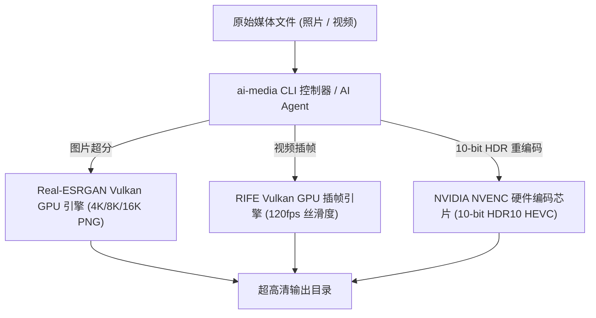

# ✨ AI Media Upscaler CLI (媒体 AI 画质重构工具)

🌐 **简体中文** | **[English](README.md)**

[](https://www.python.org/downloads/)
[](LICENSE)
[](#)
[](skills/media-upscaler/SKILL.md)

> **基于 GPU 硬件加速的图片 4K/8K AI 超分辨率重构与视频 120帧 10-bit HDR 补帧渲染工具。**

`media-pipeline` (ai-media) 是一个轻量级、高性能的 Python 命令行工具，利用显卡 GPU 硬件加速（Vulkan & NVENC 硬件芯片），实现照片画质无损放大与视频极致丝滑重构。

---

## 🖼️ 修复前后画质对比 (Before vs After)


| 📷 修复前 (原始低清/SDR) | ✨ 修复后 (Real-ESRGAN AI 4K/8K 无损重构) |
| :---: | :---: |
| 原图像素较低，纹理模糊 | **像素级细节重写，升级至 13K 超清无损 PNG** |

---

## 🤖 零手动克隆 · 一句话给 AI Agent 自动搞定 (支持 OpenClaw / Claude Code / Cursor / AGY 等)

用户**无需手动克隆仓库**，直接将下面**一句话指令**发送给任意 AI Agent，AI 就会自动远程下载规范、自动安装环境并执行媒体画质重构：

> 💬 **【零手动克隆】直接发送给 AI Agent 的指令：**
> 
> *"请读取远程规范 https://raw.githubusercontent.com/Francis-Xavier-code/media-pipeline-cli/main/skills/media-upscaler/SKILL.md ，自动帮我安装并使用 GPU 将指定目录下的图片和视频批量重构为 4K 120帧 HDR 画质。"*

---

## ✨ 核心特性

- **🖼️ 图片 4K/8K/16K AI 无损超分**：集成 Real-ESRGAN Vulkan 模型，将模糊照片无损拉升至 4K/8K 巨幅清晰度。
- **🎬 视频 120fps 光流插帧**：集成 RIFE 深度学习光流补帧，将 24fps/30fps 视频插帧至 60fps/120fps 丝滑画质。
- **🌟 10-bit HDR10 动态范围重构**：结合显卡 NVENC 硬件编码，将 SDR 视频色彩升级为 10-bit HDR10 (10.7 亿色)。
- **🔒 Tiling 显存切块保护**：智能切块渲染，显存占用恒定锁定在 ~3GB，零 Out-of-Memory 崩溃风险。

---

## 🛠️ 前置要求

| 要求 | 详情 |
|:---|:---|
| **Python** | 3.8 或更高版本 |
| **GPU** | NVIDIA RTX 系列显卡（需支持 Vulkan） |
| **图片引擎** | [Real-ESRGAN ncnn Vulkan](https://github.com/xinntao/Real-ESRGAN/releases) 可执行文件 |
| **视频引擎** | [RIFE ncnn Vulkan](https://github.com/nihui/rife-ncnn-vulkan/releases) 可执行文件 |

---

## 🛠️ 安装说明

```bash
pip install git+https://github.com/Francis-Xavier-code/media-pipeline-cli.git
```

---

## 🚀 命令行使用指南 (CLI)

### 1. 批量图片 4K/8K AI 超分
```bash
ai-media photo \
  --input "./input_photos" \
  --output "./output_4k_photos" \
  --exe "./bin/realesrgan-ncnn-vulkan.exe" \
  --gpu 0 \
  --scale 4
```

### 2. 视频 120帧补帧与 10-bit HDR 重构
```bash
ai-media video \
  --input "./input_video.mp4" \
  --output "./output_120fps_hdr" \
  --exe "./bin/rife-ncnn-vulkan.exe" \
  --gpu 0 \
  --fps 120 \
  --hdr
```

---

## 📋 命令行参数说明

### `ai-media photo`

| 参数 | 缩写 | 必填 | 默认值 | 说明 |
|:---|:---:|:---:|:---:|:---|
| `--input` | `-i` | ✅ | — | 输入图片目录 |
| `--output` | `-o` | ✅ | — | 输出 4K 图片目录 |
| `--exe` | — | ✅ | — | `realesrgan-ncnn-vulkan.exe` 路径 |
| `--gpu` | — | — | `0` | GPU 设备 ID |
| `--scale` | — | — | `4` | 放大倍率（`2`、`4`、`8`） |
| `--no-dedupe` | — | — | `false` | 禁用 MD5 内容去重 |

### `ai-media video`

| 参数 | 缩写 | 必填 | 默认值 | 说明 |
|:---|:---:|:---:|:---:|:---|
| `--input` | `-i` | ✅ | — | 输入视频文件或目录 |
| `--output` | `-o` | ✅ | — | 输出视频目录 |
| `--exe` | — | ✅ | — | `rife-ncnn-vulkan.exe` 路径 |
| `--gpu` | — | — | `0` | GPU 设备 ID |
| `--fps` | — | — | `120` | 目标帧率（`60`、`120`） |
| `--hdr` | — | — | `false` | 启用 10-bit HDR10 色彩重编码 |

---

## 📁 项目结构

```
media-pipeline-cli/
├── ai_media_upscaler/          # 核心 Python 包
│   ├── __init__.py
│   ├── cli.py                  # CLI 入口 & 参数解析
│   ├── photo_engine.py         # Real-ESRGAN Vulkan 图片超分引擎
│   └── video_engine.py         # RIFE Vulkan 视频插帧引擎
├── assets/                     # 文档对比图片
├── skills/                     # AI Agent 技能规范
│   └── media-upscaler/
│       └── SKILL.md
├── LICENSE                     # MIT 开源许可
├── pyproject.toml              # Python 包配置
├── setup.py                    # 传统安装脚本
├── README.md                   # 英文文档
└── README_ZH.md                # 中文文档
```

---

## 🤝 参与贡献

欢迎参与贡献！请按以下步骤操作：

1. Fork 本仓库
2. 创建特性分支 (`git checkout -b feature/amazing-feature`)
3. 提交更改 (`git commit -m 'Add amazing feature'`)
4. 推送到分支 (`git push origin feature/amazing-feature`)
5. 创建 Pull Request

---

## 🏗️ 架构设计



---

## 📄 开源许可

本项目基于 MIT 许可证开源。详情请参阅 [LICENSE](LICENSE) 文件。
