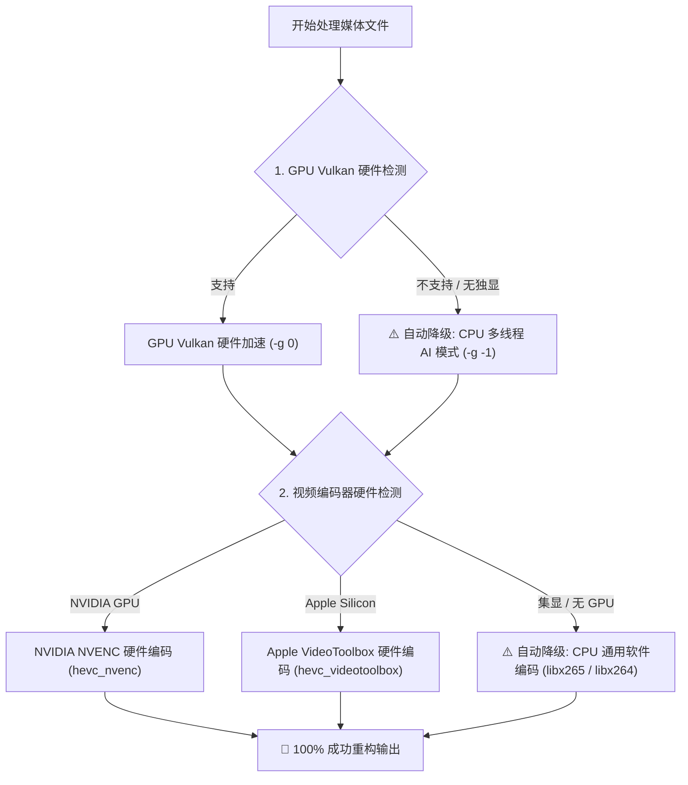

# ✨ AI Media Upscaler CLI (媒体 AI 画质重构工具)

🌐 **简体中文** | **[English](README.md)** | **[📚 完整文档目录 (docs/)](docs/CLI_USAGE_ZH.md)** | **[🏗️ 系统架构设计](docs/ARCHITECTURE_ZH.md)** | **[📦 Releases (发布包)](https://github.com/Francis-Xavier-code/media-pipeline-cli/releases)**

[](https://www.python.org/downloads/)
[](LICENSE)
[](#)
[](#)
[](#)
[](skills/media-upscaler/SKILL.md)

> **基于 GPU 硬件加速 + CPU 软硬件自动降级保底的跨平台 (Windows / Linux / macOS) 图片 4K/8K AI 超分辨率重构与视频 120帧 10-bit HDR 补帧渲染工具。**

`media-pipeline` (ai-media) 是一个轻量级、高兼容性的 Python 命令行工具。不仅能优先调用显卡 GPU 硬件加速（Vulkan, Apple Metal, NVIDIA NVENC & macOS VideoToolbox），还在**无独立显卡、集显过老或云服务器环境**下内置了 **三级 CPU 软硬件降级保底网络**，确保在任何穷尽配置的电脑上 **100% 成功运行、绝不崩溃**！

---

## 🛡️ 软硬件三级保底降级机制 (Zero-Crash Hardware Safety Net)

针对低配电脑、无独显笔记本、过老集显或无 GPU 的云服务器，系统构建了全自动软硬件降级链：



---

## 🤖 零手动克隆 · 一句话给 AI Agent 自动搞定 (支持 OpenClaw / Claude Code / Cursor / AGY 等)

用户**无需手动克隆仓库**，直接在聊天框中**点击复制**下面代码块里的【一句话指令】发送给任意 AI Agent，AI 就会自动远程读取规范、安装环境并执行渲染：

```bash
请读取远程规范 https://raw.githubusercontent.com/Francis-Xavier-code/media-pipeline-cli/main/skills/media-upscaler/SKILL.md ，自动帮我安装并使用 GPU/CPU 自动保底机制将指定目录下的图片和视频批量重构为 4K 120帧 HDR 画质。
```

---

## ⚡ 1 行在线一键安装脚本 (1-Line Online Installer)

### 🪟 Windows (PowerShell):
```powershell
irm https://raw.githubusercontent.com/Francis-Xavier-code/media-pipeline-cli/main/install.ps1 | iex
```

### 🐧 Linux & 🍎 macOS (Terminal / Bash):
```bash
curl -fsSL https://raw.githubusercontent.com/Francis-Xavier-code/media-pipeline-cli/main/install.sh | bash
```

---

## 💻 跨平台支持 (Cross-Platform Matrix)

| 操作系统 | GPU 优先硬件加速 API | CPU 自动保底降级模式 |
| :--- | :--- | :--- |
| **🪟 Windows** | Vulkan (NVIDIA / AMD / Intel) | CPU Multi-threading (`-g -1`) + `libx265` |
| **🐧 Linux (Ubuntu/Debian/Arch)** | Vulkan API | CPU Multi-threading (`-g -1`) + `libx265` |
| **🍎 macOS (Apple Silicon M1/M2/M3/M4 & Intel)** | Apple Metal / MoltenVK | CPU Multi-threading (`-g -1`) + `libx265` |

---

## 📦 Releases 发布包说明 (Portable Binaries)

我们已经在 **[GitHub Releases (v1.0.0)](https://github.com/Francis-Xavier-code/media-pipeline-cli/releases)** 正式上线官方 Release 发行版本！

您可以前往 [Releases 页面](https://github.com/Francis-Xavier-code/media-pipeline-cli/releases) 查看完整 Changelog 或获取独立二进制依赖：
- **Real-ESRGAN Vulkan**: [Real-ESRGAN Releases](https://github.com/xinntao/Real-ESRGAN/releases)
- **RIFE Vulkan**: [RIFE Releases](https://github.com/nihui/rife-ncnn-vulkan/releases)
- **FFmpeg**: 系统常规安装即可 (`sudo apt install ffmpeg` / `brew install ffmpeg`)

---

## 🖼️ 修复前后画质对比 (Before vs After)


| 📷 修复前 (原始低清/SDR) | ✨ 修复后 (Real-ESRGAN AI 4K/8K 无损重构) |
| :---: | :---: |
| 原图像素较低，纹理模糊 | **像素级细节重写，升级至 13K 超清无损 PNG** |

---

## 📚 详细文档目录 (docs/)

- 📖 **[CLI 命令使用指南 (CLI_USAGE_ZH.md)](docs/CLI_USAGE_ZH.md)**：包含 `photo` / `video` / `log` 参数及 Python API 调用。
- 🏗️ **[系统架构设计说明 (ARCHITECTURE_ZH.md)](docs/ARCHITECTURE_ZH.md)**：包含显存切块保护、光流插帧与 10-bit HDR 加速原理。

---

## 🚀 命令行快速上手 (CLI)

```bash
# 1. 查看实时日志
ai-media log

# 2. 图片 AI 超分
ai-media photo -i "./input_photos" -o "./output_photos" --exe "./realesrgan-ncnn-vulkan"

# 3. 视频 120帧与 HDR 重构
ai-media video -i "./input_video.mp4" -o "./output_video" --exe "./rife-ncnn-vulkan" --fps 120 --hdr
```

---

## 📄 开源许可

本项目基于 MIT 许可证开源。详情请参阅 [LICENSE](LICENSE) 文件。
