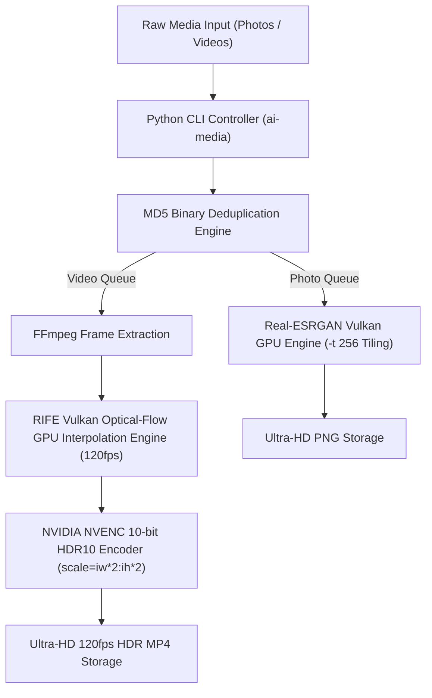

# 🏗️ System Architecture & Hardware Acceleration Specification

🌐 **[简体中文](ARCHITECTURE_ZH.md)** | **English** | **[CLI Guide](CLI_USAGE.md)** | **[Home](../README.md)**

This document details the internal design, Vulkan GPU tiling protection, RIFE optical-flow interpolation, and 10-bit HDR NVENC pipeline of `media-pipeline-cli`.

---

## 📐 1. Architecture Flowchart

---

## 🔒 2. Key Technical Innovations

1. **MD5 Photo Deduplication**: Pre-computes MD5 hashes to skip binary duplicate files (`file.jpg` vs `file(1).jpg`), saving 50%+ rendering time.
2. **Vulkan Tiling Protection (`-t 256`)**: Locks VRAM consumption at ~3 GB regardless of output resolution, eliminating CUDA Out-of-Memory crashes.
3. **Aspect-Ratio Safe Scaling (`scale=iw*2:ih*2`)**: Auto-detects portrait vs landscape aspect ratio.
4. **10-bit HDR10 NVENC Acceleration**: Hardware encodes 10.7 billion colors (`yuv420p10le`, BT.2020, SMPTE 2084).
