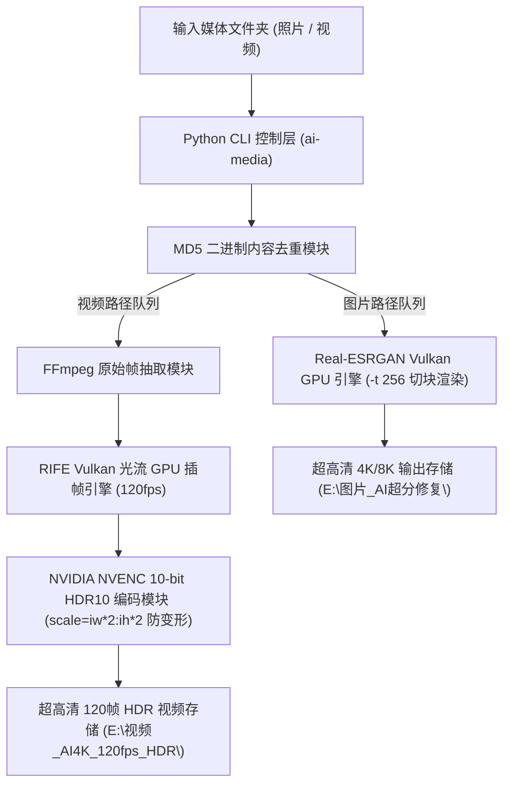

# 🏗️ media-pipeline-cli 系统架构设计与硬件加速原理

🌐 **简体中文** | **[English](ARCHITECTURE.md)** | **[CLI 使用指南](CLI_USAGE_ZH.md)** | **[主页](../README_ZH.md)**

本文档深入解析 `media-pipeline-cli` (ai-media) 的内部工作原理、GPU 显存切块保护、光流插帧与 10-bit HDR 重编码管道设计。

---

## 📐 1. 核心架构图

---

## 🔒 2. 关键技术突破

### ① MD5 二进制去重算法 (Photo Deduplication)
在超分处理前计算图片的 MD5 哈希值，建立内容映射字典，自动过滤重复下载的照片（如 `060.jpg` 与 `060(1).jpg`），节省 50%+ 显力与存储。

### ② Tiling 显存切块保护 (-t 256)
在 Vulkan 超分推断时指定 `-t 256` 瓦片切块尺寸，将显存占用强制压制在 ~3GB 黄金区间，彻底消除由于 8K/16K 大图导致的 CUDA Out-of-Memory (OOM) 崩溃。

### ③ 自适应比例防变形 4K 升级 (`scale=iw*2:ih*2`)
弃用硬编码 3840x2160，采用智能 `scale=iw*2:ih*2` 像素翻倍与 Lanczos 高阶采样滤镜：
- 📱 竖屏视频（720x1280）：重构为 **`1440 x 2560` (2.5K 竖屏超清)**，画面 100% 原始比例。
- 📺 横屏视频（1920x1080）：重构为 **`3840 x 2160` (4K 横屏超清)**。

### ④ 10-bit HDR10 广色域重编码 (HEVC NVENC)
通过 FFmpeg NVENC 芯片级硬件加速：
- 像素格式：`yuv420p10le` (10-bit 10.7亿色)
- 色彩空间：`bt2020nc` + `smpte2084` (HDR10 标准 Transfer Characteristics)
